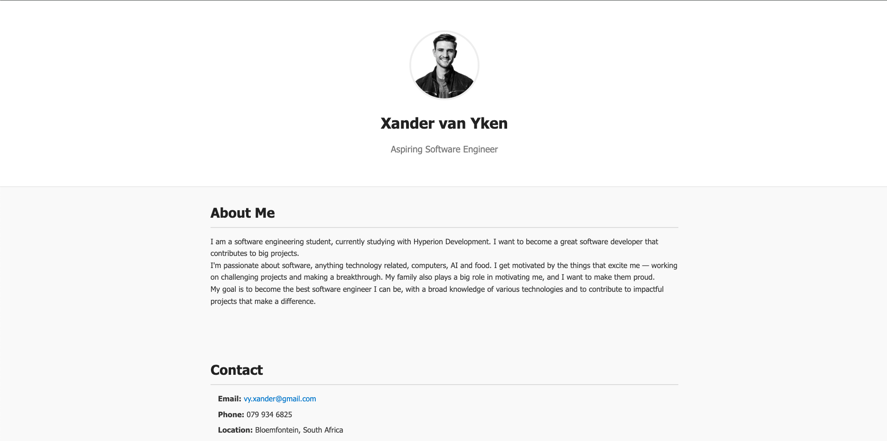

# MyCV

**MyCV** is a simple and responsive one-page website built with HTML and CSS. It serves as a digital curriculum vitae (CV) while I study software engineering. The project showcases my educational background, technical skills, and personal profile in a clean and accessible format.

## Table of Contents

- [Overview](#overview)
- [Screenshot](#screenshot)
- [Credits](#credits)

## Overview

This is a static single-page site with no interactivity or complex logic. It was designed to be a personal web-based CV that is easy to update and share online. It’s ideal for showcasing my progress as a software engineering student and can serve as a reference point for future iterations of my portfolio.

View the live version here:  
👉 [MyCV Live Demo](https://codebyxander.github.io/MyCV/)

## Screenshot

Below is a preview of the MyCV site:

## Credits

This project was designed and developed entirely by:

- [Xander](https://github.com/codebyxander)
